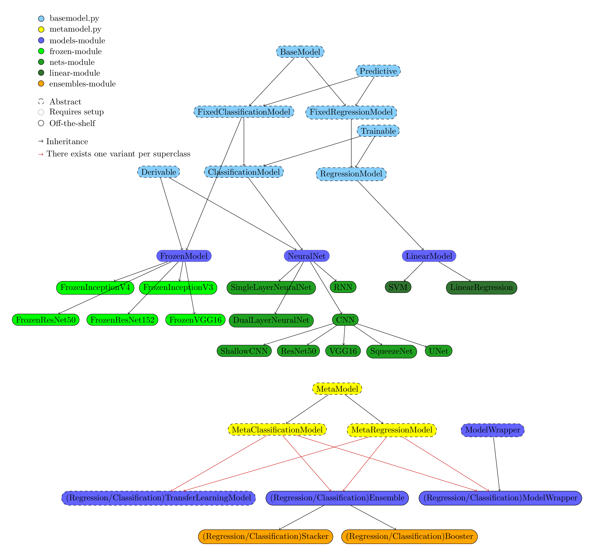

A module containing ML models and meta-models (Ensembles, Transfer learning models etc)

###An overview of the hierarchy:

# [BaseModel](basemodel.py)
### [Predictive](basemodel.py)
## [ClassificationModel](basemodel.py)
## [RegressionModel](basemodel.py)
### [Derivable](basemodel.py)
### [Trainable](basemodel.py)
## [FrozenModel](frozenmodel.py)
#### [FrozenInceptionV3](frozen/inception_v3.py)
#### [FrozenInceptionV4](frozen/inception_v4.py)
#### [FrozenVGG16](frozen/vgg16.py)
#### [FrozenResNet50](frozen/resnet50.py)
#### [FrozenResNet152](frozen/resnet152.py)
## [NeuralNet](nets/neural_net.py)
#### [SingleLayerNeuralNet](nets/single_layer_neural_net.py)
#### [DualLayerNeuralNet](nets/dual_layer_neural_net.py)
#### [RNN](nets/rnn.py)
### [CNN](nets/cnn.py)
#### [ShallowCNN](nets/shallow_cnn.py)
#### [ResNet50](nets/resnet50.py)
#### [VGG16](nets/vgg16.py)
#### [SqueezeNet](nets/squeezenet.py)
#### [UNet](nets/unet.py)
## [LinearModel](linear/linearmodel.py)
#### [LinearRegression](linear/linear_regression.py)
#### [SVM](linear/svm.py)

# [MetaModel](metamodel.py)
### [MetaPredictive](metamodel.py)
### [MetaTrainable](metamodel.py)
## [MetaClassificationModel](metamodel.py)
## [MetaRegressionModel](metamodel.py)
## [ModelWrapper](modelwrapper.py)
### [ClassificationTransferLearningModel](transferlearningmodel.py)
### [RegressionTransferLearningModel](transferlearningmodel.py)
### [ClassificationEnsemble](ensemble.py)
### [RegressionEnsemble](ensemble.py)
#### [ClassificationStacker](ensembles/stacker.py)
#### [RegressionStacker](ensembles/stacker.py)
#### [ClassificationBooster](ensembles/booster.py)
#### [RegressionBooster](ensembles/booster.py)
### [ClassificationModelWrapper](modelwrapper.py)
### [RegressionModelWrapper](modelwrapper.py)